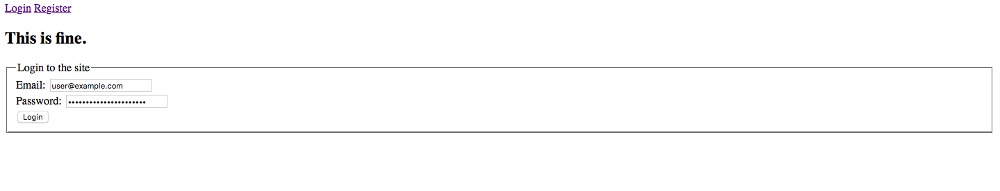
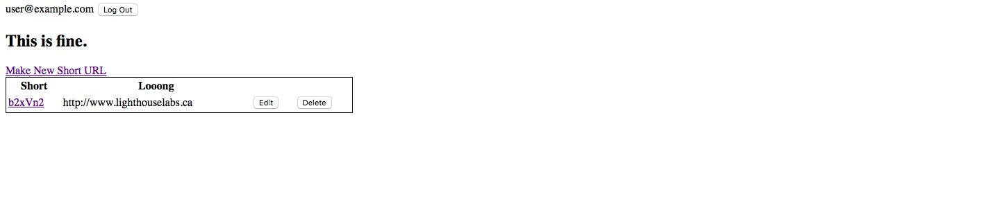

# tinyApp Project

This app allows logged in users to make short URLs from regular URLs. 
Its purpose was to practice coding node+express backend.

## Dependencies
- Node.js
- Express
- EJS
- bcrypt
- body-parser
- cookie-session

## Getting Started

- Clone the repo and enter the directory
- Install dependencies with `npm install`
- Run the development web server using the `node express_server.js` command.

