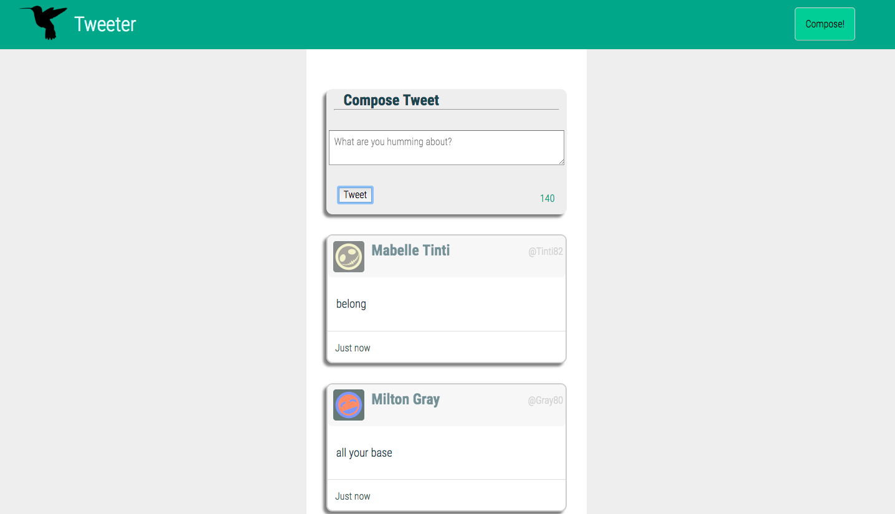
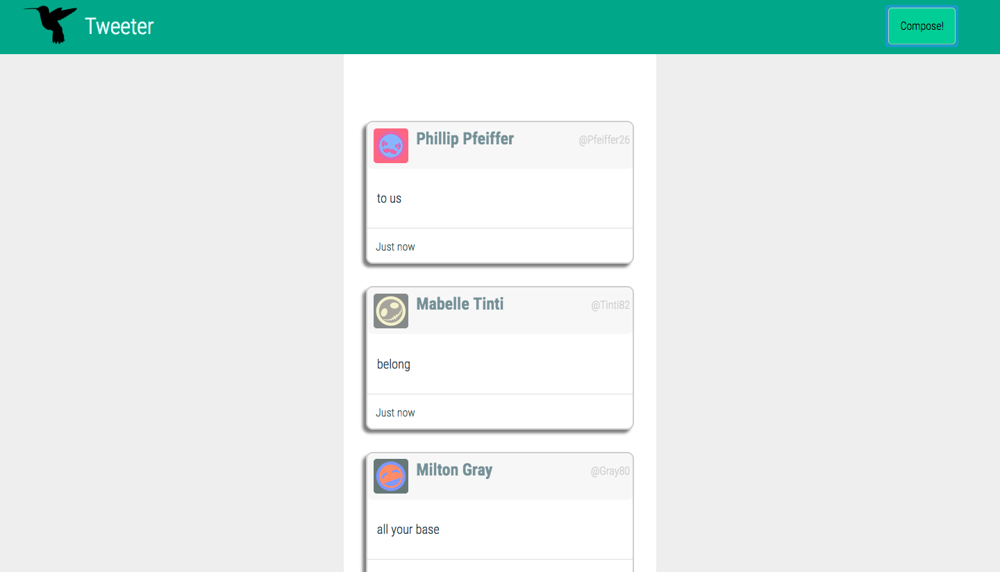
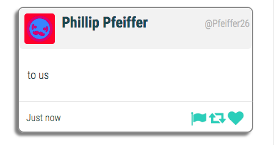

# Tweeter Project

Tweeter is a simple, single-page Twitter clone with Mongo

## Dependencies

  - body-parser
  - chance
  - express
  - jquery
  - md5
  - mongodb
  
  ## Instructions
  
  - Clone the repo and enter the directory
  - Install dependencies with `npm install`
  - Run the development web server using the `node run local` command.

